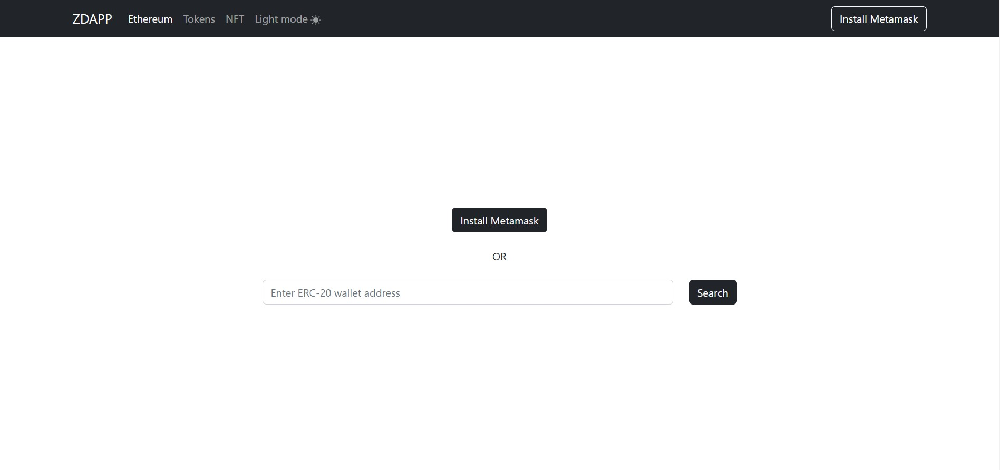
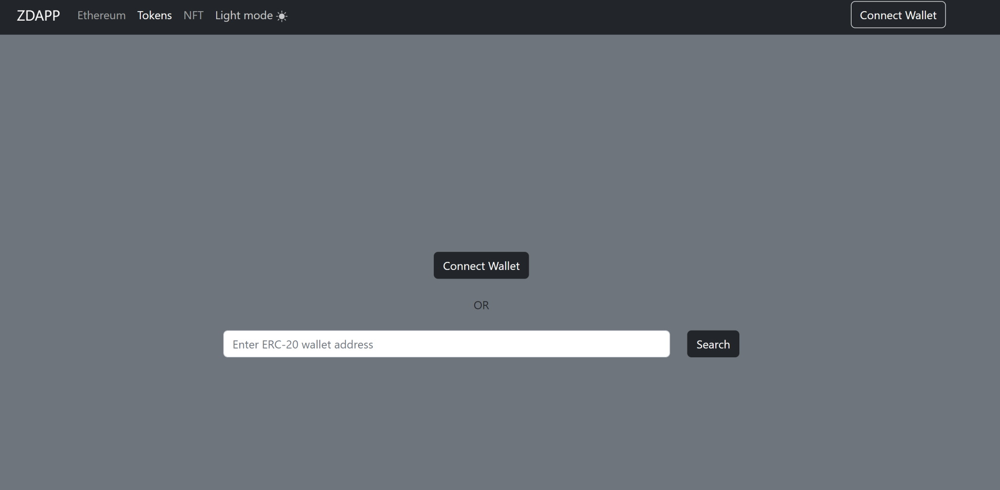
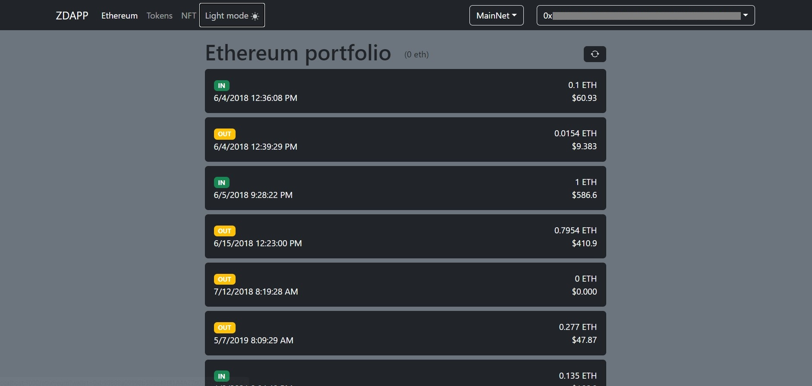
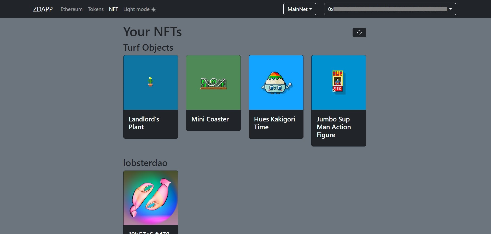
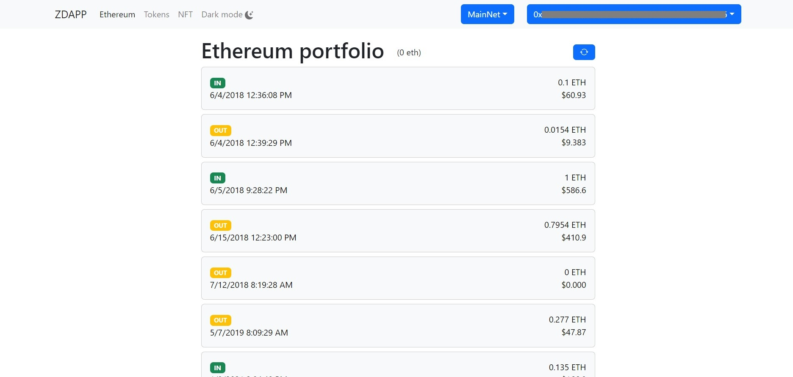
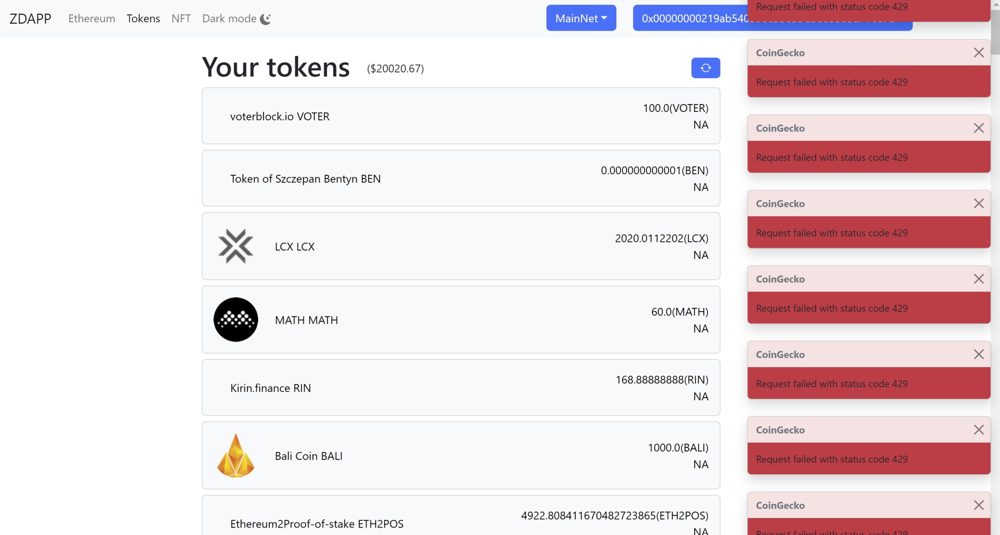

# DAPP Example

This project is an exercise about creating an erc-20 decentralized defi application using :

- React/Redux
- Bootstrap / sass
- Web3
- Etherscan API
- Alchemy SDK
- Coingecko API (This api is used to display prices in it's free version. Rate limit applies so you may see a lot of errors if you have many tokens in your wallet.)

## Installation

- run `npm install`
- copy `.env.example` to a new `.env` file
- set API key for etherscan api in `.env`
- set API key for alchemy sdk in `.env`

### Run `npm start`

Application accessible on : `http://localhost:5000`

## Features

### Summary

The application is intended to be used with Metamask wallet. The search form on the home screen is for testing with different addresses.

- Detect if Metamask is installed
- "Install Metamask" redirect to Metamask's website
- "Connect wallet" requests accounts on Metamask extension
- Toggle network change from application header
- Listening for network changes from Metamask
- Listening for account changes from Metamask
- Display list of ethereum transactions with total ethereum balance
- Display list of tokens in wallet with total value in usd
- Display list of NFTs by collection
- Refresh data button
- "Load more" results management on ethereum page
- Disconnection
- Dark mode / Light mode
- Toast error management

### Screens

#### Search by address or connect metamask wallet

|             Metamask not installed             |                     Metamask present                     |
| :--------------------------------------------: | :------------------------------------------------------: |
|  |  |

#### Ethereum

#### Tokens

#### NFTs

#### Dark mode

|                    Light mode                    |                 Dark mode                  |
| :----------------------------------------------: | :----------------------------------------: |
|  |  |

#### Errors

## Local Proxy

`src/setupProxy.js` was setup to avoid getting CORS errors on coingecko apis requests and retrieve the error message correctly. A basic condition has been put in place in thunk but this should be globally configured for future developments/deployments to manage api urls correctly.
